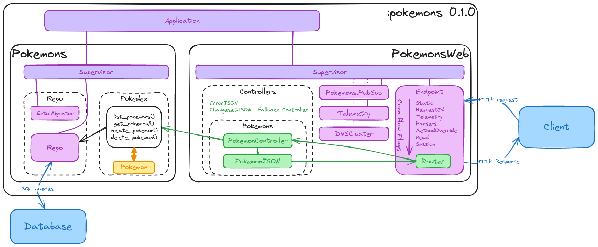

# Minimal JSON API for Elixir

This repository holds a minimal Elixir application deploying a simple JSON API using the [Phoenix framework](https://hexdocs.pm/phoenix). The repository is compatible with Phoenix versions higher than `1.7`. 

The API is capable to create and return basic informations about Pokemons (yes, the [Pokemons](https://www.pokemon.com/us/pokedex)). You can put this in production, at your risk, but it will bring zero value to your product.

## Architecture

Overall architecture of the entire application is:



The schema can be edited using [excalidraw](https://excalidraw.com/).

## Application setup

The application has been setup using the following steps. 

1. ou can create the project using `mix phx.new` by removing all options related to HTML views, JS, mails,... The database is setup using SQLite 3.

```bash
mkdir minimal-elixir-api
cd minimal-elixir-api/
mix phx.new . --app pokemons --module Pokemons --database sqlite3 --no-assets --no-dashboard --no-esbuild --no-gettext --no-html --no-mailer --no-tailwind
```

From there, the server can already be started using:

```bash
mix setup
mix phx.server
```

2. You can add a `Pokedex` context defining what is a `Pokemon` (plural `pokemons`), with `number`, `name` and `type` attributes. As you are using the `phx.gen.json` command, you will create the context (Ecto schema, Ecto migration), the controller and the JSON view at once.

```bash
mix phx.gen.json Pokedex Pokemon pokemons number:integer name:string type:string
```

Read the instructions generated and don't forget to do this.

```
Add the resource to your :api scope in lib/pokemons_web/router.ex:

    resources "/pokemons", PokemonController, except: [:new, :edit]
```

Migrate the database *(no need for Docker-related complexity, we are using straight SQLite 3)*:

```bash
mix ecto.migrate
```

the server can be (re)started using:

```bash
mix setup
mix phx.server
```

All those instructions are enough to create a valid working project. If you read closely the repository, you will see that some naming and structures have changed to match my approach of Elixir development (`application.ex` at root, one supervisor per folder/context, module naming matching folder structure,...).

## Use the API

Navigate to `http://localhost:4000/`, you will display an error page displaying all available route in the API.

All pokemons can be listed using GET requests:

```bash
curl -i http://localhost:4000/api/pokemons
curl -i http://localhost:4000/api/pokemons/1
```

New pokemons can be added using POST requests:

```bash
curl -iX POST http://localhost:4000/api/pokemons \
    -H 'Content-Type: application/json' \
    -d '{"pokemon": {"number": 25, "name": "Pikachu", "type": "Électrik"}}'
```

Pokemons can be deleted using DELETE requests:

```bash
curl -iX DELETE http://localhost:4000/api/pokemons/1
curl -iX DELETE http://localhost:4000/api/pokemons/2
```

## Deployment

You can deploy by either using an [Erlang release](#deploy-using-an-erlang-release) or by using a [Docker container](#deploy-using-a-dockerfile). Pick your sword. Both deployments use the `prod` configuration.

For both deployments, create an environnment file `.env` with this content:

```bash
SECRET_KEY_BASE=h3x6k7JMU/zNgsBZKtDyj9KHLrmDp76bbvp6cFdAWFod/BkJjUd2bLYaVlRRYnVi DATABASE_PATH=data/pokemons.db
```

The secret key base can be regenerated using `mix phx.gen.secret`.

### Deploy using an Erlang release

You can create the minimal `rel/` folder using,

```bash
mix phx.gen.release --docker
```

Build the release binary using,

```bash
source .env
MIX_ENV=prod mix release
```

And you can start the server with,

```bash
source .env
PHX_SERVER=true _build/prod/rel/pokemons/bin/pokemons start
```

### Deploy using a Dockerfile

You can create the minimal `Dockerfile` and `rel/` folder using,

```bash
mix phx.gen.release --docker
```

A `docker-compose.yml` is available to run the application using your preferred way to package anything. Just,

```bash
docker compose up
```

The deployment uses the `prod` configuration.

## Development

If you want to extend this project, you can ensure everything remains good by using the following tools:

```bash
mix format # Code formatting
mix credo --strict # Static code analysis
mix test # Unit tests
```

## Ressources

All the content written in this repository have been created using those ressources:

- [Phoenix documentation, JSON and APIs](https://hexdocs.pm/phoenix/json_and_apis.html)
- [Phoenix documentation, mix phx.gen.json](https://hexdocs.pm/phoenix/Mix.Tasks.Phx.Gen.Json.html)
- [Phoenix documentation, Routing - Ressources](https://hexdocs.pm/phoenix/routing.html#resources)