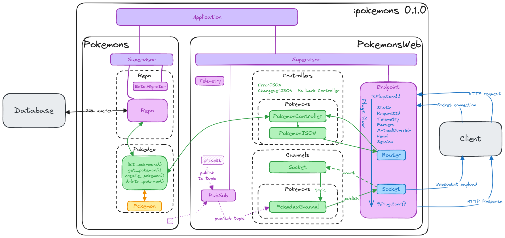

# Minimal JSON API for Elixir

## Goals

This repository holds a minimal Elixir application deploying a simple JSON API using the [Phoenix framework](https://hexdocs.pm/phoenix). The repository is compatible with Phoenix versions higher than `1.7`. 

The API is capable of two things:

1. deploy a JSON *(REST ?)* API to create and return basic informations about Pokemons (yes, the [Pokemons](https://www.pokemon.com/us/pokedex)). 
2. deploy a Websockets API to push pokemon events to clients connected to the API.

You can put this in production, at your risk, but it will bring zero value to your product.

## Architecture

Overall architecture of the entire application is:

The schema can be edited using [excalidraw](https://excalidraw.com/).

## Guides

- **Scaffolding**: How to setup easily the JSON and Websockets API ? Follow the steps in [docs/scaffolding.md](docs/scaffolding.md).
- **API Usage**: How to connect to the JSON or Websockets API ? See this in [docs/api_usage.md](docs/api_usage.md).
- **Deployment**: How to deploy through Erlang releases and Dockerfiles ? The answer is in [docs/deployment.md](docs/deployment.md).
- **Ressources**: All ressources used to create this repository are listed in [docs/ressources.md](docs/ressources.md)